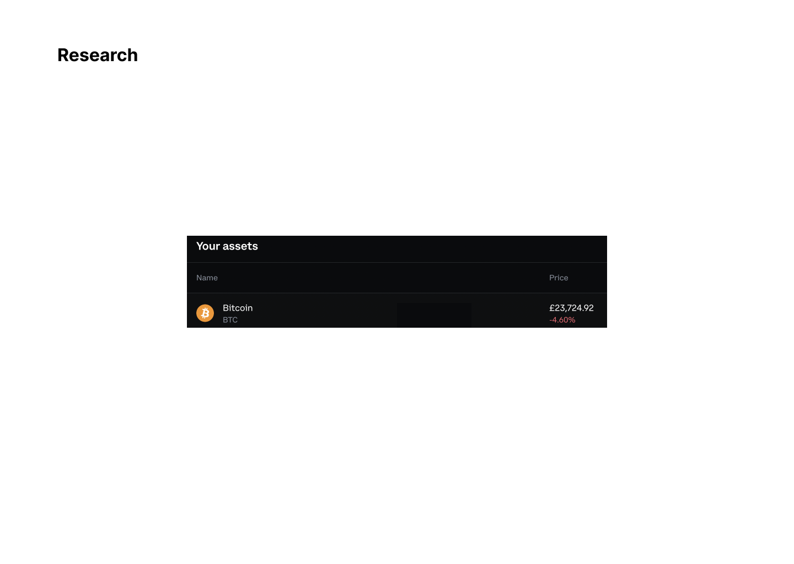
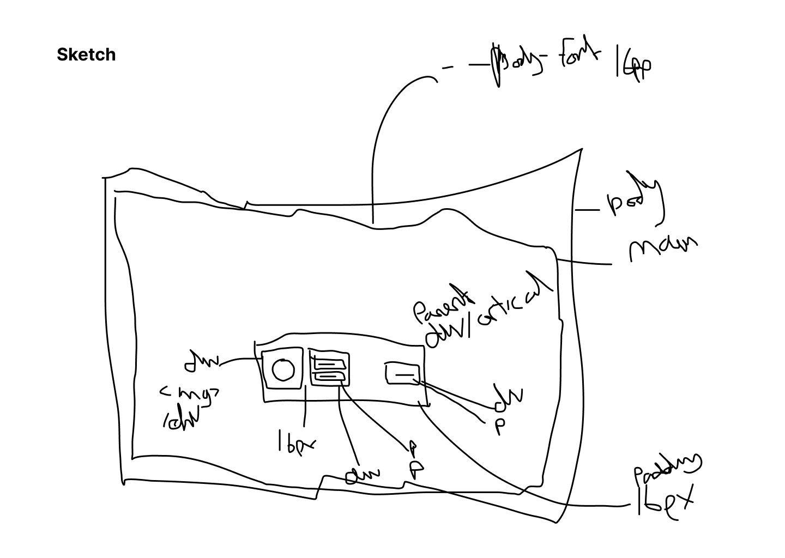
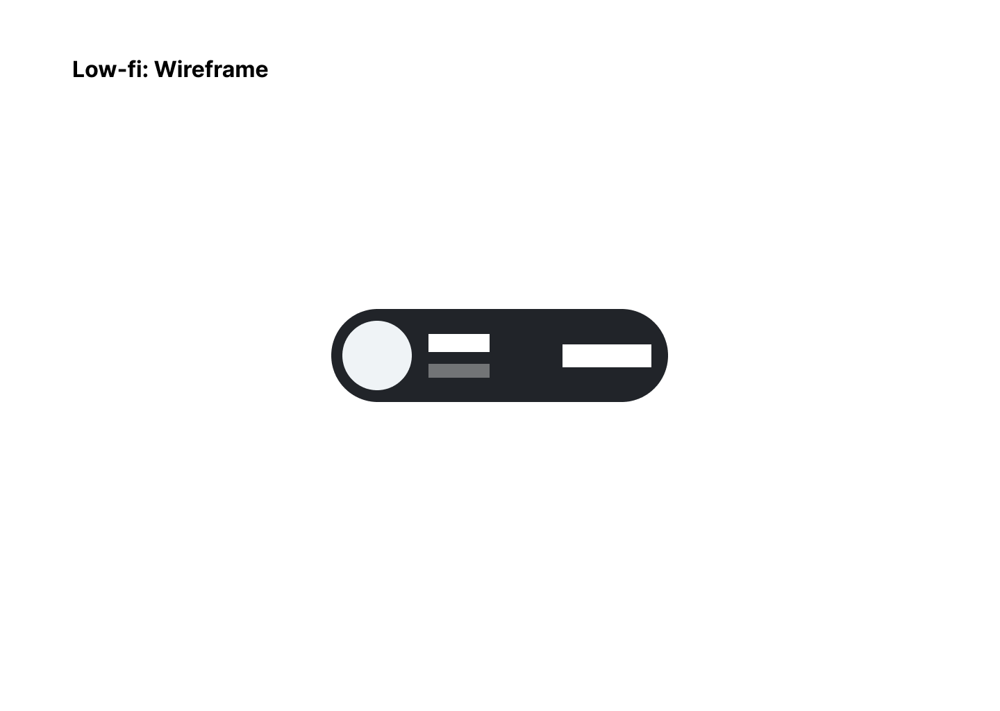
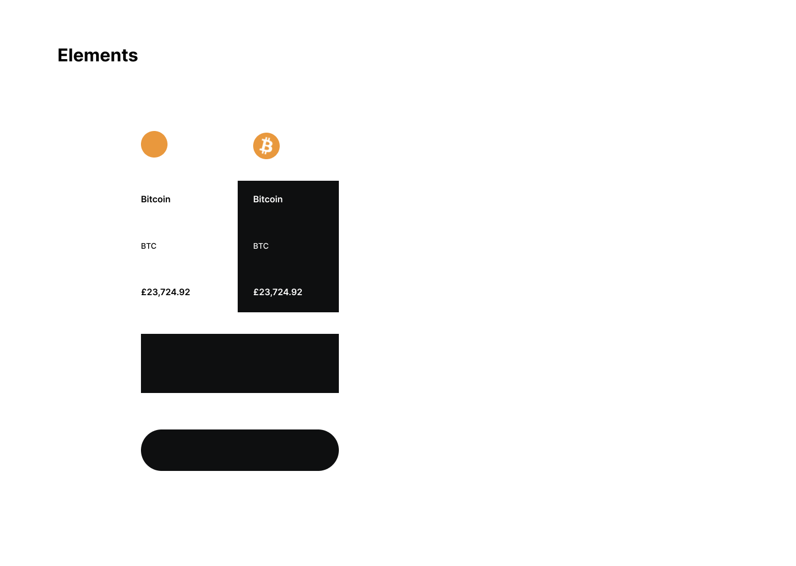
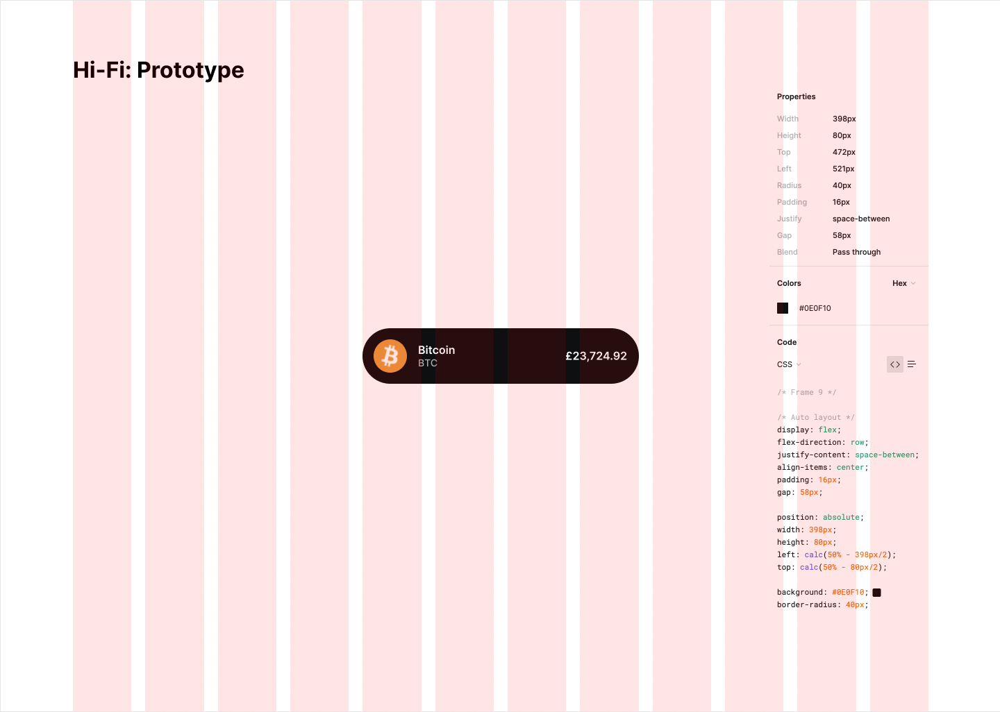

## The Quest:

Today I would like to embark upon an API quest!
It certainly seems that all dealings with APIs are either, quests, voyages or even suicide missions may be a more descriptive term. It is said that many people are still lost at sea looking for their way home and I must say that I am in those choppy waters also rowing frantically against the tide. APIs are no joke but I decided to have a laugh at my primitive knowledge today by setting myself a task.

Crypto currency is still a thing (kinda), I actually tried to buy Bitcoin back in 2013/14 I believe it was when Mt.Gox were one of the only shops in town. I had committed to being ok with losing £100 investment to secure some Bitcoins because the website was the diciest things Id ever experienced at the time but I wanted to see what this thing was all about, I'm not sure what the price was for 1 back then but it was next to nothing - suffice to say if I had been able to overcome my inability to understand pgp and if the process for buying was simpler than the array of hoops they required - I would be sipping Piña Coladas on a beach somewhere exotic pretending to be The Wolf of Wallstreet.

Anyway that is all (freshly) in the past and I have tasked myself with creating a webpage using a crypto API to get the current market data for Bitcoin. The data will include the coin name, symbol, price and logo and I will display it in an aesthetically pleasing way. I will structure the code as such that data for any coin the API provides could be gained.

At this point in time I am unsure if I want the price to stay updated when a user visits the site, I will think about this along the way or once I am able to print and place the data visible to the DOM.

So that's it, get the data, whack it on the page and style it. Sounds simple enough for now but I think I'll need a plan - Let's Go!
<br>
<br>
<br>

### Research
I looked around for some examples of how crypto is displayed online, scoping out CoinMarketCap, Binance, Coinbase, Kraken and a couple of other titans of the space. I settled on using Coinbase for a design reference as I have always admired their design aesthetic and how they manage to simplify the user experience even when there is a mammoth of information to present. Minimalism is very much the way I like things to be personally as a user and as a designer - Donald Judd would be proud.

<br>


<br>
<br>
<br>

### Sketching
Next up are some quick sketches in Figma just to get an overview sense on the elements that would be required and how they might be structured in html. I was also able to plant the seeds of the kind of spacing system I would use.

<br>


<br>
<br>
<br>

### Wireframes
Moving swiftly on from those drunkard sketches I whipped together some low-fidelity wireframes. This allowed me to play with the balance and flow of the site and to get a sense of how the visual hierarchy of elements would work whilst including how I would prioritise the information.

<br>


<br>
<br>
<br>

### Elements
I whittled down the elements that would be required for this design so that I had those constraints in place already before sourcing the data. It was helpful to use as the final list of data and elements that might be required for the project.

<br>


<br>
<br>
<br>

### HI-FI
Now that the elements were secured I worked iteratively to produce a high-fidelity mockup of how I would position the data once I fetched it and how the final layout would look. All visible data was to be sourced from the APi. I used Figma grid, autolayout and constraints to ensure the accuracy of spacing and positioning although I was happy for the width of the element to be fluid up to a point. This got me thinking about max-widths before I even had a plan for the code.

<br>


<br>
<br>
<br>

## Code Plan
After the pixel pushing was completed I jumped into the code like a game of double dutch. I'm a good skipper as I did boxing training for 17 years and skipped everyday, but I knew I would get tangled in the ropes with this game if I didn't have some sort of a coding plan.

### JS

### GET DATA:
* fetch the promise - function ✅
* await and convert to json() - async function ✅

### EXPLORE THE DATA & SAVE TO VARIABLES:
* locate image of crypto (link address)
 * How to turn an link to a png download to a link address ❌ (Use placeholder circle until figured out!)
* locate name crypto ✅
* locate symbol crypto ✅
* locate price of crypto ✅
* convert price to two decimal places -- toFixed(2)  ✅ (The step below covers this!)
* convert price to dollars ✅
  <!--
    Format the price to USD using it's locales:   
    Using the currency field, you can specify which specific currency you want to format to, such as 'USD', 'CAD' or 'INR'.
    The useGrouping field is a boolean field that enables you to group the number using commas (or periods, for some locales). By default, it is set to true
 -->
     ```javascript
     const price = 1470000.15;
     let dollarUS = Intl.NumberFormat("en-US", {
     style: "currency",
     currency: "USD",
     });
     ```
    
Think about how the price should update, addEventClick button?, 5minute setInterval?
Using saved variables data should I create a function to create my own object of data collected?
          

### HTML
* create structure for card layout ✅
* give all content id or class accordingly, keep naming general, kebab-case-the-names ✅

### CSS
* use css variable for efficiency ✅
* use kebab-case-naming-convention ✅
* DRY principle ✅

### TIME TO CODE!!!  ✅ ✅
 * To view the final project live:
 * Please see the project files for a deeper look at the code
 * The API used is from: https://documenter.getpostman.com/view/5734027/RzZ6Hzr3:
 * Exact API used: "https://api.coinstats.app/public/v1/coins?skip=0&limit=1"
 <br>
<br>

